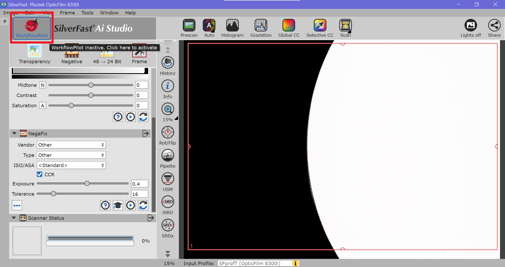
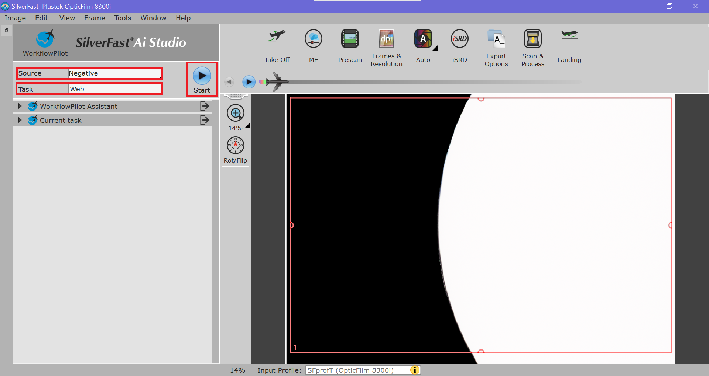
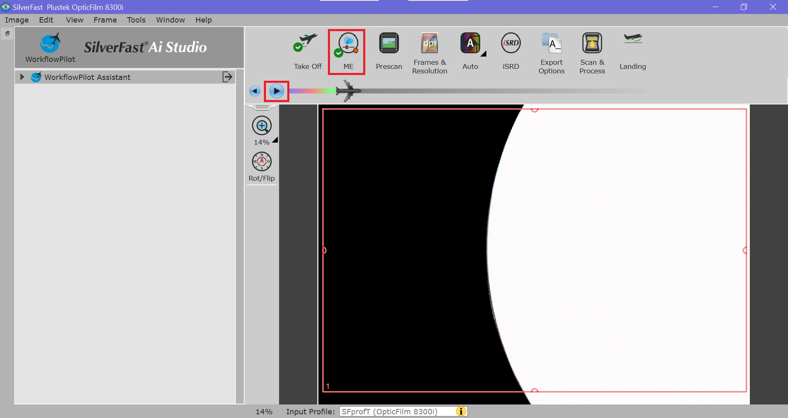
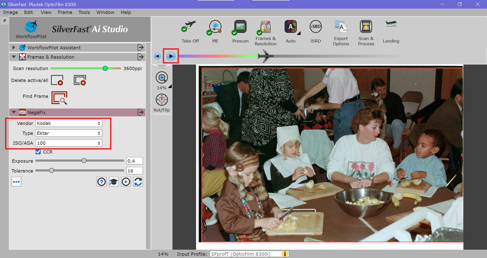
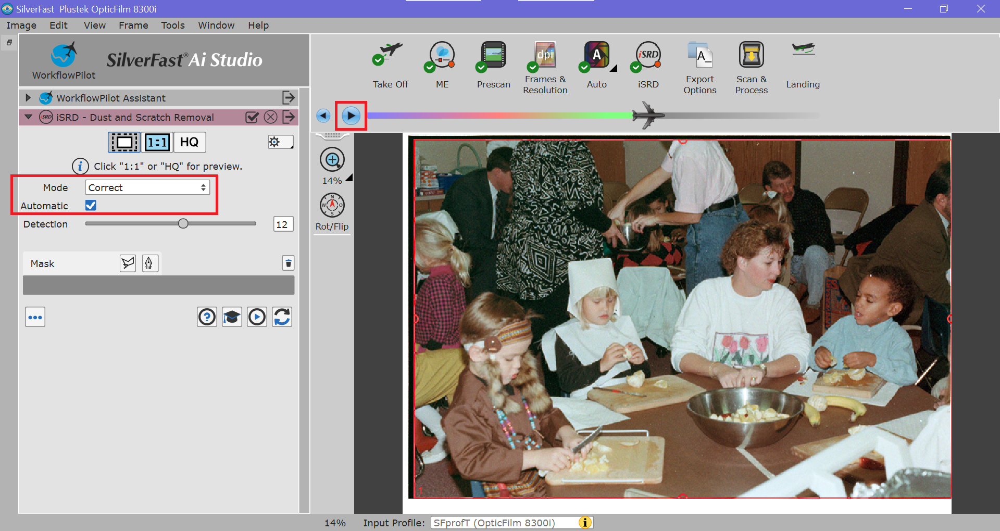
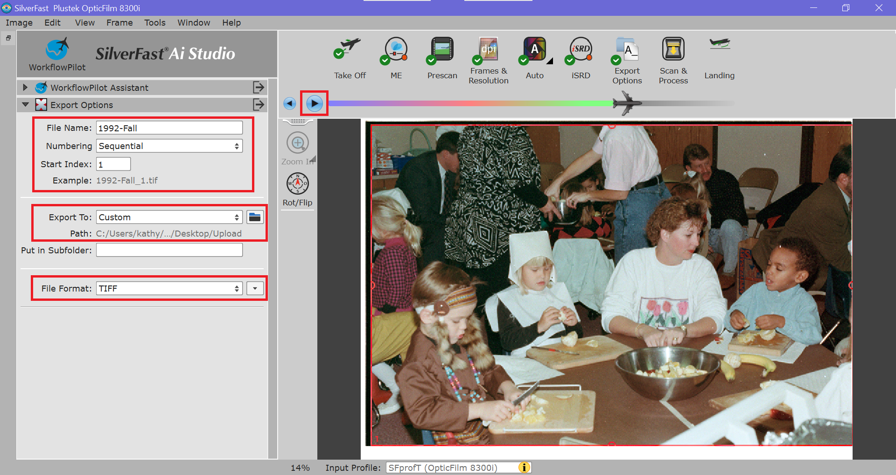
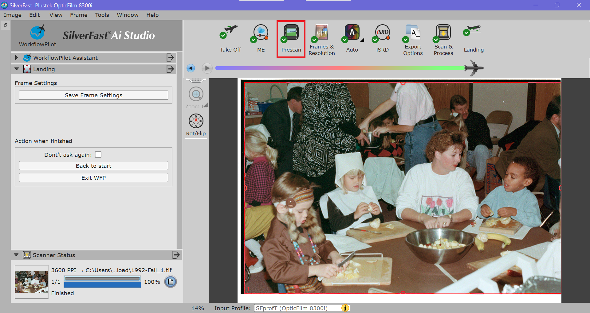

# Film Negative Scanning With Automatic Backup
*August 23, 2022*

## Overview

This tutorial provides a method to scan old film photo negatives using a [Plustek OpticFilm scanner](https://plustek.com/us/products/film-photo-scanners/opticfilm-8300i-ai/) for archival and editing. Photos are saved in RAW format, converted to JPG using a script, then remotely backed up to my server.

## Gallery

[Gallery]()

## Details

Many people don't realize that 35mm film photos can be digitized in much higher resolution than old prints can provide. This requires the original negatives and, for optimal quality, requires that the photos were taken on a camera with good optics.

My father was an amateur photographer and preserved all photo negatives from our family vacations, trips he took in his 20s, and even a concert he snuck into in the 1970s using a fake press pass. For years, I’ve wanted to archive these images and restore them. My mother also expressed interest, and her recent retirement gave us the perfect chance to start. For her birthday, I bought a professional-grade film and slide scanner. The scanning process isn’t a simple one-click operation, so I created this tutorial to assist her from across the country.

The method below catalogs 35mm film photos in RAW format at a resolution ~18MP per photo. The scanner is capable of scanning at twice that resolution. However, I found in practice that scanning a 35 mm photo at 7200ppi simply accentuates the film grain, even in photos taken using a high end SLR from the 1990s. As reluctant as I am to lose data during archival, 200MB per photo vs 50MB is too much when all we're doing is sharpening film grain.

One of the most interesting features of the scanner is its ability to scan multiple times at different exposure levels. It's a bit like HDR – bringing out features that have spent decades lost in the shadows or washed out in the highlights. These features aren't always visible in the preview, but they're encoded in the RAW image data and can be brought out when editing in Lightroom or [Darktable](https://www.darktable.org/).

An [ImageMagick](https://imagemagick.org/) script converts the RAW files to JPG. [Syncthing](https://syncthing.net/) automatically backs up all scanned photos to my server across the the country, which stores them in a RAID 6 array. The server can withstand up to two hard drive failures without any data loss, but in abundance of caution, all photos are regularly backed up to external hard drives as well. The end result is three copies of every archived photo stored in two locations.

## Software Installation

### SilverFast 9 installation & configuration

Install the SilverFast 9 software from the included USB drive. The default location for the installer should be:

`D:\Windows\SilverFast\SilverFast-9-Installer.exe`

A color calibration slide is included with the Plustek scanner. It is important to calibrate the scanner before using it to ensure color accuracy of scanned negatives and avoid hours of headaches later. I completed this process after the scanner arrived, so we only need the resulting color calibration files. Copy color calibration files from the USB drive to the SilverFast program data directory.

Copy:

`D:\IT8 Reference Files`

To:

`C:\ProgramData\LaserSoft Imaging\SilverFast 9\`

Instructions for color calibration are [available here for reference.](https://www.youtube.com/watch?v=_iuX81yl0Hc)

Run **SilverFast 9** and log in using the account information provided.

## Negatives Scanning Process

Load a strip of negatives into the tray.
- Wear white cotton gloves to avoid getting grease on the negatives. 
- Remove any dust using the air blaster bulb.

Gently insert the tray into scanner until you feel a slight click.

**Initial software setup** is completed once per scanning session. **Scanning steps** are completed for each individual negative.

### Initial software setup

Run the **SilverFast 9** software, then click **Start**.

Click **Cancel** if the software complains that it's waiting for a printer.

Click **WorkflowPilot** in the top left corner to activate the scanning wizard. This tool simplifies the scanning process.



In the **WorkflowPilot**, set the **Source** to **Negative** and the **Task** to **Web**.

```
Source: Negative
Task: Web
```
Then, click **Start** to advance to the **ME** section.



In the **ME** section, ensure that Multi-Exposure (ME) is enabled. A red indicator will be shown next to the ME icon to confirm that it's enabled. **No action** should be required.

Then, click the **right arrow** to advance to **Prescan**.



### Scanning steps

A prescan will run automatically when **Prescan** is selected. This creates a fast, low-quality preview used to make adjustments prior to running the final scan. After the prescan is complete, the software should automatically advance to the **Frames & Resolution** section.

Use the **Rot/Flip (Compass Button)** to rotate and flip image as needed.

**Click and drag** the red box around image to capture as much of it as possible in the final scan. Some black borders may make it through to the end. That's okay as long as import parts of the photo aren't cut off.

*Note: If the negative strip is not aligned properly in the tray, large black borders will be visible and parts of the image will be cut off. To realign the negative strip, remove the tray, center the negative, reinsert the tray, and click **Prescan** again to update the preview.*


After cropping, ensure that the **Scan resolution** is set to the second highest setting, **3600ppi**. This should be the default. The highest setting is overkill, takes too long to scan, and will create gigantic photos (~200 MB) that basically just accentuate the film grain when zoomed in.

```
Scan resolution: 3600ppi
```


Next, configure the **NegaFix** settings. This is an important step to ensure that the colors are correct in the scanned image.

Select the appropriate **Vendor**, **Type**, and **ISO/ASA** based on the film used to capture the photo. The film type is typically indicated in small text at the top of the negative strip. It can be difficult to decipher the text on the negative strip, so you might need to Google what you read to figure out which settings to select. For example:

```
KODAK GT. 800-4 = Kodak Max Zoom 800
KODAK CX 100 = Kodak Ektar 100
KODAK 5100 EKTAR 25-1 = Kodak Ektar 100 & Exposure=-0.5 (compensation for lack of support for Ektar 25)
```

After identifying the film for NegaFix, click the **right arrow** to advance to **Auto** settings.



In the **Auto** settings, let the software automatically adjust the the **Input Histogram** and **Gradiation**. Less is more here. Sometimes the settings chosen by the software will make the image too bright or too dark. If that's the case, disable them by clicking the **checkmarks** next to each setting. It's best to start with a neutral scan, then edit the image later to avoid losing data.

Once this check is complete, click the **right arrow** to advance to the **iSRD** section.


In the the **iSRD** section, ensure the **Mode** is set to **Correct**, the **Automatic** box is **checked**. These should be the default settings.

```
Mode: Correct
Automatic: *check*
```

Then, click the **right arrow** to advance to **Export Options**.



In the **Export Options**, configure the settings used to save all photos that will be scanned during the current scanning session.
- Input a **File Name** for the scanning session using the most accurate date you can provide. My preferred format is Year-Month-Day. However, unless the photos are from a holiday or birthday party, I doubt the exact date will be known. Do the best you can; e.g. 1992-Fall, 1992-09, 1992-12, etc.
- Set **Numbering** to **Sequential** to automatically save photos with sequential numbering; e.g. 1992-Fall_1.tif,  1992-Fall_2.tif,  1992-Fall_3.tif, etc.
- Set the **Start Index** to **1** for every new photo album. This is a nerdy way for the software to ask where to start counting. You can change this if you want to continue counting from some other number.
- Ensure that **Export To** is set to **Custom** and the **Upload** folder on the Desktop is selected. This is the location that scanned photos will be saved to. Everything inside the Upload folder is automatically uploaded to my server and backed up.
- Use the **TIFF** file format to preserve quality.

```
File Name: <something descriptive> (e.g. 1992-Fall)
Numbering: Sequential
Start Index: 1
Export To: Custom
File Format: TIFF
```

Once everything is set, click **Next** to **Scan & Process** the image.



After a successful scan, advance the tray in the scanner until you feel a slight click to get to the to the next negative.

Click **Prescan** and repeat the **Scanning steps** process. Very few settings changes will be required for new negatives in the same album, if any. When a prescan reveals that a photo is blurry or not worth keeping, just move to the next one and click **Prescan** again to update the preview.



## Photo conversion to JPG

Original scans in TIF format are large and mostly useful for archiving photos in high quality. They enable old photos to be given new life through editing. For everyday use, however, the JPG format is better.

To convert all scanned photos to JPG for immediate use on social media, email, etc, double click the **Convert** icon on the Desktop. This tool will convert all TIF images in the Upload folder to the JPG format and copy them to the Scanned Pictures folder.


Photos inside the **Scanned Pictures** folder may be renamed, reorganized, moved, copied, uploaded to social media, etc. This folder is not monitored or uploaded to the server.


---
*License: [CC BY-SA 4.0 Deed](https://creativecommons.org/licenses/by-sa/4.0/) - You may copy, adapt, and use this work for any purpose, even commercial, but only if derivative works are distributed under the same license.*

*Category: Notes*